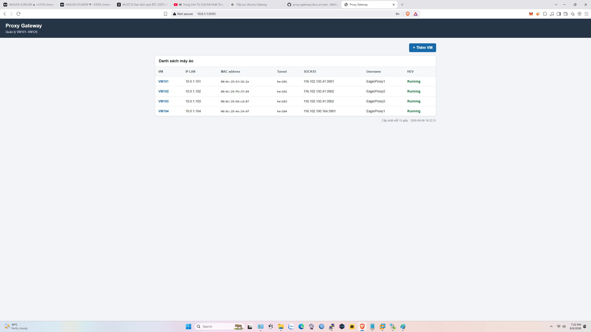
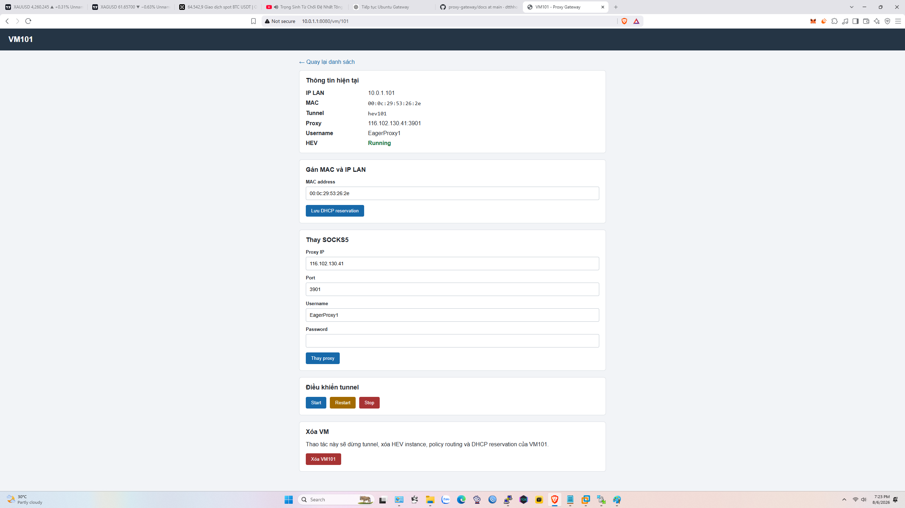
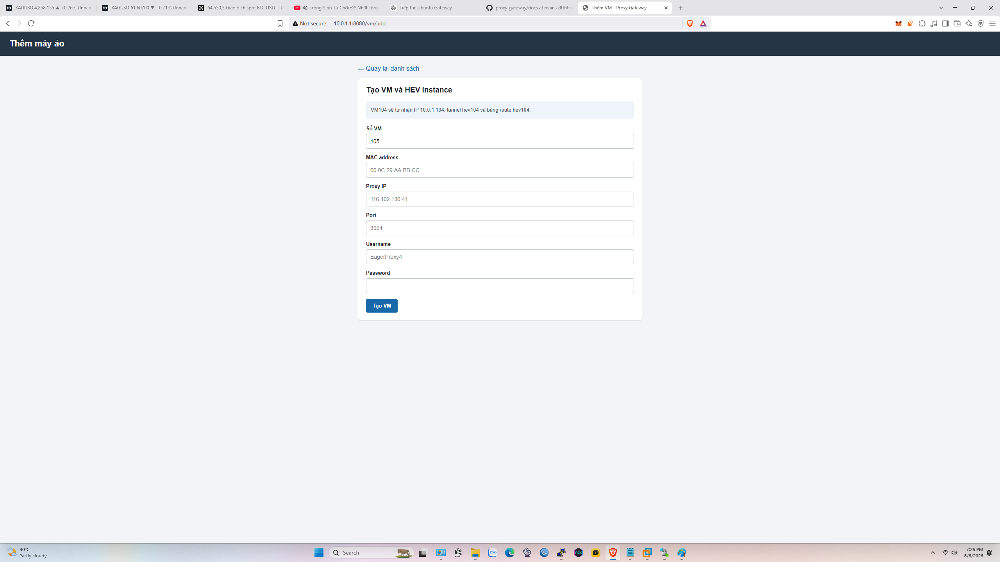
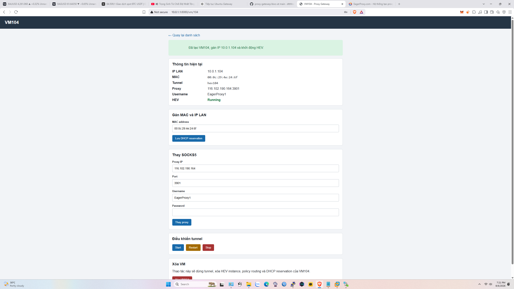
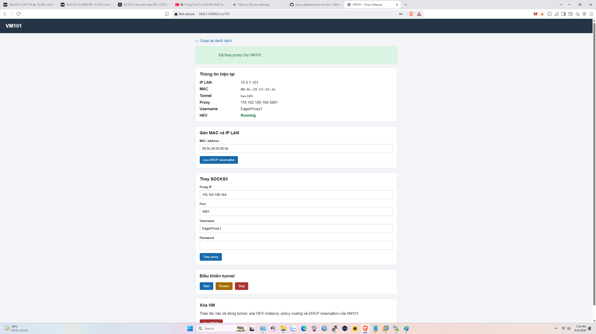
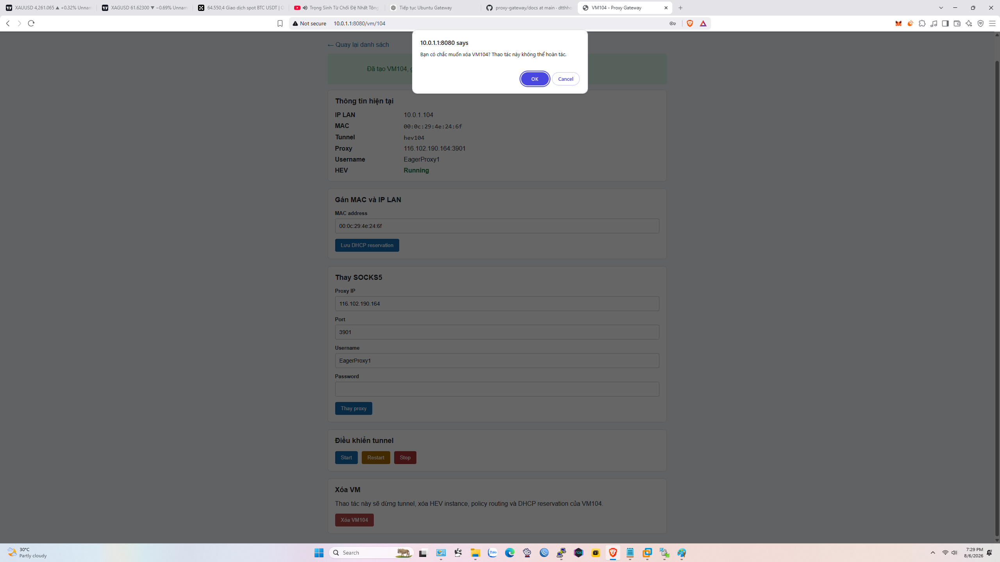
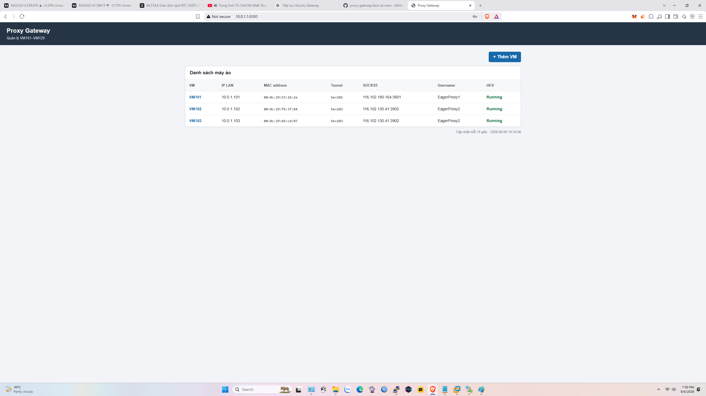
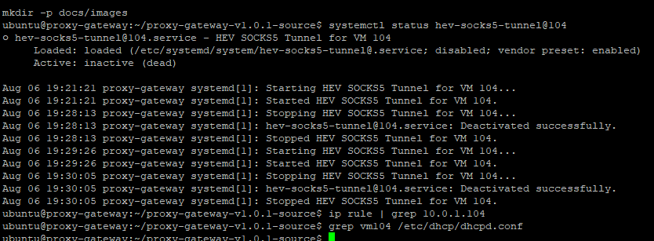

# Hướng dẫn Cài đặt Proxy Gateway

Version: **v1.0.2**

---

# Mục lục

1. Introduction
2. Project Overview
3. Hardware Requirements
4. Software Requirements
5. Network Architecture
6. Ubuntu Installation
7. Network Configuration
8. DHCP Server Configuration
9. HEV SOCKS5 Tunnel
10. Web UI
11. Creating a Virtual Machine
12. Managing a Virtual Machine
13. Backup and Restore
14. Troubleshooting
15. Appendix

---

# Chương 1 - Giới thiệu

## 1.1 Mục đích

Proxy Gateway là một gateway nhẹ dựa trên Ubuntu Server, được thiết kế để định tuyến nhiều máy ảo qua các proxy SOCKS5 độc lập.

Thay vì cấu hình proxy bên trong từng hệ điều hành khách, mỗi máy ảo chỉ cần sử dụng Ubuntu gateway làm default gateway.

Gateway thực hiện toàn bộ việc định tuyến một cách trong suốt.

Mỗi VM có riêng:

- tunnel HEV SOCKS5 riêng
- routing table riêng
- policy routing rule riêng
- DHCP reservation riêng

Vì mỗi VM có một tunnel độc lập, khi một proxy gặp lỗi thì chỉ VM đó bị ảnh hưởng.

Các máy ảo khác vẫn tiếp tục hoạt động bình thường.

---

## 1.2 Mục tiêu thiết kế

Dự án được thiết kế với các mục tiêu sau.

- Nhẹ
- Dễ triển khai
- Dễ bảo trì
- Yêu cầu phần cứng thấp
- Không cần cài thêm phần mềm bên trong hệ điều hành khách
- Cấu hình tự động
- Định tuyến fail-close
- Quản lý Web đơn giản

---

## 1.3 Môi trường mục tiêu

Proxy Gateway dành cho các môi trường chạy nhiều máy ảo.

Các ví dụ điển hình gồm:

- VMware Workstation
- Proxmox VE
- ESXi
- VirtualBox

Hệ điều hành khách có thể là:

- Windows
- macOS
- Linux

Gateway hoạt động độc lập với hệ điều hành khách.

---

## 1.4 Các tính năng chính

Phiên bản hiện tại cung cấp:

- Thêm VM
- Xóa VM
- Đổi Proxy SOCKS5
- DHCP Reservation
- Quản lý HEV Tunnel
- Start / Stop / Restart Tunnel
- Rollback tự động
- Backup tự động
- Quản lý bằng Web UI

---

# Chương 2 - Tổng quan dự án

## 2.1 Kiến trúc tổng thể

```
                Internet
                    │
                    │
            192.168.2.1
                    │
              WiFi / Ethernet
                    │
        Ubuntu Proxy Gateway
         WAN : wlp2s0
         LAN : enp1s0
           10.0.1.1
                    │
────────────────────────────────────
      Virtual Machines
────────────────────────────────────

VM101
10.0.1.101
↓

HEV101
↓

SOCKS5 Proxy #1


VM102
10.0.1.102
↓

HEV102
↓

SOCKS5 Proxy #2


...

VM120
10.0.1.120
↓

HEV120
↓

SOCKS5 Proxy #20
```

Mỗi máy ảo có một HEV tunnel độc lập.

Không có tunnel nào được dùng chung.

---

## 2.2 Các thành phần

Dự án gồm một số thành phần chính.

### Ubuntu Server

Đóng vai trò gateway.

Nhiệm vụ:

- IP forwarding
- Policy routing
- DHCP server
- Web UI
- HEV Tunnel

---

### HEV SOCKS5 Tunnel

Tạo một tunnel riêng cho mỗi máy ảo.

Ví dụ:

VM101

↓

hev101

↓

SOCKS5 Proxy

---

### ISC DHCP Server

Tự động cấp địa chỉ IP.

Các địa chỉ IP dành riêng được gắn với địa chỉ MAC của VM.

---

### Flask Web UI

Cung cấp giao diện quản lý bằng trình duyệt.

Các chức năng gồm:

- Thêm VM
- Xóa VM
- Đổi Proxy
- DHCP Reservation
- Điều khiển Tunnel

---

## 2.3 Cấu trúc thư mục

```
config/

examples/

scripts/

systemd/

webui/

docs/
```

---

## 2.4 Các thư mục runtime

Trong quá trình hoạt động bình thường, gateway sử dụng:

```
/etc/hev/

/usr/local/sbin/

/opt/proxy-gateway-ui/

/etc/dhcp/

/etc/iproute2/
```

---

# Chương 3 - Yêu cầu phần cứng

## 3.1 Tối thiểu

CPU

Dual-core x86_64

Bộ nhớ

2 GB

Storage

8 GB SSD

Network

2 network interfaces

---

## 3.2 Khuyến nghị

CPU

Intel J1900

or newer

Bộ nhớ

4 GB

Storage

32 GB SSD

Network

Gigabit Ethernet

---

## 3.3 Phần cứng đã kiểm thử

Phiên bản hiện tại đã được kiểm thử với:

Ubuntu Server 22.04 LTS

Intel J1900

4 GB RAM

Realtek Gigabit Ethernet

Intel Wireless Adapter

VMware Workstation

Windows 11

HEV SOCKS5 Tunnel

Flask Web UI

---

## 3.4 Khuyến nghị về mạng

Sử dụng hai interface mạng độc lập.

WAN

Kết nối với Internet.

LAN

Kết nối tới:

- VMware Host
- Proxmox
- Switch

Không bridge WAN và LAN với nhau.

Thiết kế này bảo đảm policy routing hoạt động đúng.

---

Kết thúc Chương 3.

---

# Chương 4 - Yêu cầu phần mềm

## 4.1 Hệ điều hành

Bản phát hành hiện tại được phát triển và kiểm thử trên:

- Ubuntu Server 22.04 LTS (64-bit)

Các phiên bản Ubuntu khác có thể hoạt động nhưng chưa được kiểm thử chính thức.

---

## 4.2 Các gói bắt buộc

Cần các thành phần phần mềm sau.

| Thành phần | Mục đích |
|-----------|---------|
| HEV SOCKS5 Tunnel | Tunnel SOCKS5 |
| ISC DHCP Server | DHCP reservation |
| dnsmasq | Chuyển tiếp DNS |
| Flask | Web UI |
| Python 3 | Backend |
| systemd | Quản lý service |

---

## 4.3 Yêu cầu trình duyệt

Web UI đã được kiểm thử bằng:

- Google Chrome
- Microsoft Edge

JavaScript phải được bật.

---

## 4.4 Network Interface

Tên interface mặc định được dùng xuyên suốt hướng dẫn này:

| Interface | Chức năng |
|------------|----------|
| wlp2s0 | WAN |
| enp1s0 | LAN |

Nếu tên interface của bạn khác, hãy sửa các file cấu hình trước khi triển khai.

---

## 4.5 Firewall

Phiên bản hiện tại giả định Ubuntu Server được sử dụng như một gateway nội bộ đáng tin cậy.

Không yêu cầu cấu hình firewall bổ sung.

Nếu bổ sung firewall sau này, hãy bảo đảm rằng:

- DHCP được cho phép.
- DNS được cho phép.
- Các HEV tunnel không bị chặn.
- Policy routing vẫn hoạt động.

---

# Chương 5 - Kiến trúc mạng

## 5.1 Topology logic

```
                     Internet
                         │
                  Home Router
                 192.168.2.1
                         │
                 WAN (wlp2s0)
             192.168.2.200/24
                         │
====================================================
              Ubuntu Proxy Gateway
====================================================
                 LAN (enp1s0)
                 10.0.1.1/24
                         │
        ┌───────────────┴───────────────┐
        │                               │
     VMware Host                    Proxmox
        │                               │
        └───────────────┬───────────────┘
                        │
                Virtual Machines
```

---

## 5.2 Phân bổ địa chỉ

Client động:

```
10.0.1.2
↓

10.0.1.99
```

Các VM được dành riêng:

```
VM101 → 10.0.1.101

VM102 → 10.0.1.102

...

VM120 → 10.0.1.120
```

---

## 5.3 Luồng packet

Đường đi của traffic:

```
VM

↓

Gateway

↓

Policy Routing

↓

HEV Tunnel

↓

SOCKS5 Proxy

↓

Internet
```

Hệ điều hành khách không cần bất kỳ cấu hình proxy nào.

---

## 5.4 Thiết kế Fail-Close

Mỗi VM có routing rule riêng.

Nếu một tunnel không khả dụng:

- Truy cập Internet của VM đó bị dừng.
- Không sử dụng đường đi trực tiếp ra WAN.
- Các VM khác tiếp tục hoạt động.

Điều này ngăn việc rò rỉ IP ngoài ý muốn.

---

## 5.5 Định tuyến độc lập

Mỗi VM có:

- một routing table
- một HEV interface
- một proxy SOCKS5
- một DHCP reservation

Không có routing table nào được dùng chung.

---

# Chương 6 - Cài đặt Ubuntu Server

## 6.1 Bộ cài đặt

Tải xuống:

Ubuntu Server 22.04 LTS

Tạo USB boot.

---

## 6.2 Tùy chọn cài đặt

Trong quá trình cài đặt:

Language

English

Keyboard

Default

Storage

Sử dụng toàn bộ ổ đĩa.

Network

Cấu hình sau.

---

## 6.3 Tạo user

Ví dụ:

Username

```
ubuntu
```

Hostname

```
proxy-gateway
```

---

## 6.4 SSH Server

Cài OpenSSH Server.

Khuyến nghị mạnh việc quản lý từ xa.

---

## 6.5 Lần boot đầu tiên

Sau khi cài đặt:

Cập nhật hệ điều hành.

```
sudo apt update

sudo apt upgrade -y
```

Reboot nếu cần.

---

## 6.6 Kiểm tra cài đặt

Xác nhận:

```
hostname

ip address

systemctl status ssh
```

SSH phải ở trạng thái active.

---

## 6.7 Bước tiếp theo

Chương tiếp theo cấu hình:

- WAN interface
- LAN interface
- DHCP
- DNS
- IP forwarding

Trước khi tiếp tục, hãy bảo đảm Ubuntu boot bình thường và truy cập SSH hoạt động.

---

Kết thúc Chương 6.

---

# Chương 7 - Cấu hình mạng

## 7.1 Tổng quan

Proxy Gateway sử dụng hai network interface độc lập.

| Interface | Mục đích |
|------------|----------|
| WAN | Kết nối Internet |
| LAN | Mạng máy ảo |

Hai interface này không được bridge với nhau.

---

## 7.2 WAN Interface

WAN interface kết nối gateway với mạng gia đình hoặc văn phòng hiện có.

Cấu hình điển hình:

| Tham số | Giá trị |
|-----------|-------|
| Interface | wlp2s0 |
| Address | 192.168.2.200 |
| Gateway | 192.168.2.1 |

WAN interface cung cấp:

- Truy cập Internet
- DNS upstream
- Kết nối tới SOCKS5 server

---

## 7.3 LAN Interface

LAN interface phục vụ tất cả máy ảo.

Cấu hình điển hình:

| Tham số | Giá trị |
|-----------|-------|
| Interface | enp1s0 |
| Address | 10.0.1.1/24 |

Các máy ảo sử dụng:

Default Gateway

```
10.0.1.1
```

DNS Server

```
10.0.1.1
```

---

## 7.4 IP Forwarding

IPv4 forwarding phải được bật.

Kiểm tra:

```
cat /proc/sys/net/ipv4/ip_forward
```

Kết quả mong đợi:

```
1
```

---

## 7.5 Routing Policy

Mỗi VM sử dụng source-based routing.

Ví dụ:

| VM | Địa chỉ nguồn | Routing Table |
|----|----------------|---------------|
| VM101 | 10.0.1.101 | hev101 |
| VM102 | 10.0.1.102 | hev102 |
| VM103 | 10.0.1.103 | hev103 |

Mỗi routing table chứa:

```
default dev hevXXX

10.0.1.0/24 dev enp1s0
```

---

## 7.6 Kiểm tra

Các lệnh hữu ích:

```
ip address

ip rule

ip route

ip route show table hev101
```

---

# Chương 8 - Cấu hình DHCP Server

## 8.1 Mục đích

DHCP server tự động cấp địa chỉ IP cho client.

Các địa chỉ dành riêng được tạo cho các máy ảo được quản lý.

---

## 8.2 Dải địa chỉ động

Dải điển hình:

```
10.0.1.2

↓

10.0.1.99
```

Các client nằm ngoài dải VM được quản lý sẽ nhận địa chỉ từ dải này.

---

## 8.3 Địa chỉ dành riêng

Các VM được quản lý nhận địa chỉ cố định.

Ví dụ:

```
VM101

↓

10.0.1.101
```

```
VM102

↓

10.0.1.102
```

```
VM120

↓

10.0.1.120
```

---

## 8.4 DHCP Reservation

Mỗi reservation chứa:

- Host name
- Địa chỉ MAC
- Địa chỉ IP cố định

Ví dụ:

```
host vm104 {

    hardware ethernet 00:0c:29:4e:24:6f;

    fixed-address 10.0.1.104;

}
```

---

## 8.5 Reservation tự động

Khi thêm VM từ Web UI:

1. HEV instance được tạo.
2. DHCP reservation được tạo.
3. DHCP service được restart.
4. Cấu hình được kiểm tra.

Nếu kiểm tra thất bại:

- Cấu hình trước đó được tự động khôi phục.

---

## 8.6 Kiểm tra

Các lệnh hữu ích:

```
systemctl status isc-dhcp-server

dhcpd -t -4 -cf /etc/dhcp/dhcpd.conf

grep vm104 /etc/dhcp/dhcpd.conf
```

---

# Chương 9 - HEV SOCKS5 Tunnel

## 9.1 Tổng quan

Mỗi VM có một HEV tunnel độc lập.

Ví dụ:

```
VM104

↓

hev104

↓

SOCKS5 Proxy

↓

Internet
```

Không có tunnel nào được dùng chung.

---

## 9.2 HEV Instance

Mỗi instance chứa:

```
config.yml

instance.conf
```

Vị trí:

```
/etc/hev/104/
```

---

## 9.3 Quy tắc đặt tên interface

Tên tunnel:

```
hev101

hev102

hev103

...

hev120
```

Mỗi interface có một routing table riêng.

---

## 9.4 Quản lý service

Mỗi HEV instance được systemd quản lý.

Ví dụ:

```
hev-socks5-tunnel@101

hev-socks5-tunnel@102

hev-socks5-tunnel@103
```

Các lệnh hữu ích:

```
systemctl start hev-socks5-tunnel@104

systemctl stop hev-socks5-tunnel@104

systemctl restart hev-socks5-tunnel@104

systemctl status hev-socks5-tunnel@104
```

---

## 9.5 Gán Proxy

Mỗi tunnel lưu:

- Proxy IP
- Proxy Port
- Username
- Password

Web UI tự động cập nhật các giá trị này.

---

## 9.6 Fail-Close

Nếu tunnel dừng:

- Routing vẫn được gán vào tunnel.
- Không có route trực tiếp ra WAN.
- Truy cập Internet dừng.
- Các VM khác không bị ảnh hưởng.

Hành vi này ngăn rò rỉ traffic.

---

## 9.7 Kiểm tra

Các lệnh hữu ích:

```
ip link show hev104

systemctl status hev-socks5-tunnel@104

ip rule

ip route show table hev104
```

---

Kết thúc Chương 9.

---

# Chương 10 - Giao diện Web

## 10.1 Tổng quan

Web UI là giao diện quản lý chính của Proxy Gateway.

Nó cho phép quản trị viên quản lý máy ảo mà không cần sửa file cấu hình hoặc chạy shell script thủ công.

Phiên bản hiện tại hỗ trợ:

- Dashboard
- Thêm VM
- Xóa VM
- Đổi Proxy
- DHCP Reservation
- Điều khiển Tunnel

---

## 10.2 Dashboard

Dashboard hiển thị tất cả máy ảo đã cấu hình.

Ảnh chụp màn hình khuyến nghị:

### Hình 1 – Proxy Gateway Dashboard



Dashboard liệt kê các máy ảo đã cấu hình, địa chỉ LAN, proxy SOCKS5 được gán,
tunnel interface và trạng thái HEV hiện tại.

Thông tin hiển thị gồm:

| Cột | Mô tả |
|---------|-------------|
| VM | Số máy ảo |
| IP LAN | Địa chỉ IP LAN được gán |
| MAC | MAC của DHCP reservation |
| Tunnel | HEV interface |
| SOCKS5 | Proxy IP và Port |
| Username | SOCKS5 username |
| HEV Status | Running / Stopped |

---

## 10.3 Trang chi tiết VM

Chọn một VM sẽ mở trang chi tiết.

Ảnh chụp màn hình khuyến nghị:

### Hình 2 – Trang chi tiết máy ảo



Trang chi tiết VM cung cấp quản lý DHCP reservation, thiết lập proxy,
điều khiển tunnel và chức năng Delete VM.

Trang này cung cấp:

- Thông tin VM
- DHCP reservation
- Cấu hình SOCKS5
- Tunnel control
- Xóa VM

---

## 10.4 Chỉ báo trạng thái

Running

```
Running
```

Stopped

```
Stopped
```

Các giá trị này được lấy trực tiếp từ systemd.

---

## 10.5 Điều hướng

Các trang chính:

```
Dashboard

↓

Add VM

↓

VM Detail
```

Điều hướng được thiết kế đơn giản nhằm giảm lỗi thao tác.

---

# Chương 11 - Tạo máy ảo

## 11.1 Tổng quan

Việc tạo một VM gồm hai phần.

1. Tạo hệ điều hành khách.
2. Đăng ký VM trong Proxy Gateway.

Web UI thực hiện bước thứ hai.

---

## 11.2 Trang Add VM

Ảnh chụp màn hình khuyến nghị:

### Hình 3 – Form Add VM



Nhập số VM, địa chỉ MAC, SOCKS5 server, port, username
và password trước khi tạo instance.

Các trường bắt buộc:

| Trường | Mô tả |
|-------|-------------|
| Số VM | 101–120 |
| Địa chỉ MAC | Network adapter của máy khách |
| Proxy IP | SOCKS5 server |
| Port | SOCKS5 port |
| Username | SOCKS5 username |
| Password | SOCKS5 password |

---

## 11.3 Kiểm tra dữ liệu

Trước khi tạo VM, Proxy Gateway kiểm tra:

- Số VM
- Định dạng địa chỉ MAC
- Proxy IP
- Proxy Port
- Username
- Password

Các giá trị không hợp lệ bị từ chối ngay lập tức.

---

## 11.4 Quy trình tạo

Các thao tác sau được thực hiện tự động.

Bước 1

Tạo HEV instance.

↓

Bước 2

Tạo routing table.

↓

Bước 3

Tạo policy routing rule.

↓

Bước 4

Sinh cấu hình HEV.

↓

Bước 5

Tạo DHCP reservation.

↓

Bước 6

Restart DHCP server.

↓

Bước 7

Start HEV tunnel.

↓

Bước 8

Quay lại trang chi tiết VM.

---

## 11.5 Rollback tự động

Nếu DHCP reservation thất bại:

- HEV instance bị xóa.
- Routing table bị xóa.
- Policy routing rule bị xóa.
- Cấu hình được khôi phục.

Hệ thống không để lại VM ở trạng thái tạo dở.

---

## 11.6 Kiểm tra

Sau khi tạo thành công, kiểm tra:

- VM xuất hiện trên Dashboard.
- Trạng thái HEV là Running.
- VM nhận đúng IP.
- Public IP khớp với proxy SOCKS5 đã cấu hình.

Ảnh chụp màn hình khuyến nghị:

### Hình 4 – Tạo VM thành công



Sau khi tạo, Web UI xác nhận địa chỉ LAN được gán và hiển thị
HEV tunnel ở trạng thái Running.

---

# Chương 12 - Quản lý máy ảo hiện có

## 12.1 Tổng quan

Sau khi VM được tạo, mọi tác vụ quản lý hằng ngày được thực hiện từ trang chi tiết VM.

---

## 12.2 Thay đổi DHCP Reservation

Cập nhật địa chỉ MAC nếu network adapter của máy ảo thay đổi.

Quy trình:

Sửa MAC

↓

Lưu

↓

Restart DHCP

↓

Reservation mới có hiệu lực

---

## 12.3 Thay đổi Proxy SOCKS5

Ảnh chụp màn hình khuyến nghị:

### Hình 5 – Cập nhật Proxy thành công



Thông báo thành công xác nhận cấu hình SOCKS5 đã được cập nhật
và HEV service đã restart thành công.

Các trường có thể sửa:

- Proxy IP
- Port
- Username
- Password

Hệ thống tự động:

- kiểm tra proxy
- cập nhật cấu hình
- restart HEV service

---

## 12.4 Điều khiển Tunnel

Có ba thao tác.

### Start

Khởi động HEV service.

---

### Restart

Restart tunnel mà không thay đổi cấu hình.

Hữu ích sau khi thay đổi thiết lập proxy.

---

### Stop

Dừng tunnel.

Cơ chế fail-close ngăn truy cập Internet trực tiếp.

---

## 12.5 Xóa VM

Các ảnh chụp màn hình khuyến nghị:

### Hình 6 – Xác nhận xóa VM



Hộp thoại xác nhận giúp tránh vô tình xóa cấu hình VM.

### Hình 7 – Dashboard sau khi xóa VM



VM đã xóa không còn xuất hiện trên Dashboard.

### Hình 8 – Kiểm tra backend sau khi xóa



Output terminal xác nhận HEV service đã inactive và
policy-routing rule của VM đã được xóa.

Khi xóa VM, hệ thống tự động thực hiện:

- Stop HEV service
- Xóa cấu hình HEV
- Xóa routing table
- Xóa policy routing rule
- Xóa tunnel interface
- Xóa DHCP reservation
- Xóa trạng thái systemd

Hộp thoại xác nhận được hiển thị trước khi xóa.

---

## 12.6 Tạo lại VM

VM đã xóa có thể được tạo lại bằng cùng:

- Số VM
- Địa chỉ MAC
- Proxy SOCKS5

Gateway tự động dựng lại toàn bộ tài nguyên cần thiết.

---

## 12.7 Kiểm tra

Sau khi tạo lại, kiểm tra:

- Dashboard hiển thị VM.
- Tunnel ở trạng thái Running.
- DHCP reservation tồn tại.
- Public IP khớp với proxy SOCKS5.

Quy trình này đã được xác nhận trong các bài kiểm thử hệ thống v1.0.2.

---

Kết thúc Chương 12.

---

# Chương 13 - Backup và Restore

## 13.1 Tổng quan

Khuyến nghị mạnh việc backup định kỳ trước khi:

- nâng cấp phần mềm
- sửa thiết lập mạng
- thay đổi cấu hình DHCP
- cập nhật các thành phần Web UI

Gateway lưu cấu hình trong các file text thuần, giúp backup và restore đơn giản.

---

## 13.2 Các thư mục quan trọng

Các vị trí sau nên được đưa vào mọi bản backup.

| Thư mục | Mục đích |
|-----------|---------|
| /etc/hev | Cấu hình HEV instance |
| /etc/dhcp | Cấu hình DHCP server |
| /usr/local/sbin | Script quản lý |
| /opt/proxy-gateway-ui | Flask Web UI |
| /etc/iproute2 | Định nghĩa routing table |

---

## 13.3 Tạo Backup

Ví dụ:

```bash
sudo tar czf proxy-gateway-backup.tar.gz \
/etc/hev \
/etc/dhcp \
/usr/local/sbin \
/opt/proxy-gateway-ui \
/etc/iproute2
```

Khi có thể, hãy lưu archive bên ngoài gateway.

---

## 13.4 Khôi phục Backup

Giải nén archive:

```bash
sudo tar xzf proxy-gateway-backup.tar.gz -C /
```

Restart các service cần thiết:

```bash
sudo systemctl restart isc-dhcp-server

sudo systemctl restart proxy-gateway-ui
```

Restart từng HEV tunnel nếu cần.

---

## 13.5 Kiểm tra Backup

Kiểm tra:

- Cấu hình HEV tồn tại.
- DHCP reservation tồn tại.
- Web UI khởi động thành công.
- Các máy ảo nhận đúng địa chỉ IP.

---

## 13.6 Backup Git Repository

Source code của dự án được quản lý bằng Git.

Quy trình khuyến nghị:

```text
Commit

↓

Push

↓

Create Tag

↓

Create Release
```

Điều này bảo toàn toàn bộ lịch sử phát triển.

---

# Chương 14 - Xử lý sự cố

## 14.1 HEV Service không khởi động

Kiểm tra:

```bash
systemctl status hev-socks5-tunnel@104
```

Xem log:

```bash
journalctl -u hev-socks5-tunnel@104
```

---

## 14.2 DHCP Server lỗi

Kiểm tra cấu hình:

```bash
dhcpd -t -4 -cf /etc/dhcp/dhcpd.conf
```

Restart:

```bash
systemctl restart isc-dhcp-server
```

---

## 14.3 VM không truy cập được Internet

Kiểm tra:

```bash
ip rule

ip route

systemctl status hev-socks5-tunnel@104
```

Xác nhận rằng:

- HEV tunnel đang chạy
- routing table tồn tại
- proxy SOCKS5 có thể truy cập được

---

## 14.4 Sai Public IP

Kiểm tra:

- Proxy IP
- Proxy Port
- Username
- Password

Cập nhật proxy từ Web UI nếu cần.

---

## 14.5 Web UI không tải được

Kiểm tra trạng thái service:

```bash
systemctl status proxy-gateway-ui
```

Xem log:

```bash
journalctl -u proxy-gateway-ui
```

---

## 14.6 Add VM thất bại

Các nguyên nhân có thể:

- Địa chỉ MAC không hợp lệ
- DHCP reservation bị trùng
- Proxy không hợp lệ
- Số VM đã tồn tại
- Lỗi cấu hình HEV

Gateway tự động rollback các thao tác thất bại.

---

## 14.7 Delete VM thất bại

Kiểm tra:

- HEV service status
- DHCP server status
- File permissions
- systemd logs

Nếu rollback được kích hoạt, hãy điều tra lỗi được báo trước khi thử lại.

---

## 14.8 Các lệnh hữu ích

```bash
ip address

ip rule

ip route

systemctl

journalctl

dhcpd -t

hostname

ping

curl https://ifconfig.me
```

---

# Chương 15 - Phụ lục

## 15.1 Thư mục dự án

```
config/
docs/
examples/
scripts/
systemd/
webui/
```

---

## 15.2 Các thư mục runtime

```
/etc/hev/

/etc/dhcp/

/usr/local/sbin/

/opt/proxy-gateway-ui/

/etc/iproute2/
```

---

## 15.3 Quy tắc đặt tên

| Thành phần | Ví dụ |
|------|---------|
| VM | VM104 |
| Tunnel | hev104 |
| Routing Table | hev104 |
| Service | hev-socks5-tunnel@104 |

---

## 15.4 Môi trường đã kiểm thử

Hệ điều hành

Ubuntu Server 22.04 LTS

Phần cứng Gateway

Intel J1900

Bộ nhớ

4 GB

Nền tảng máy khách

VMware Workstation

Mạng

Source-based policy routing

Tunnel

HEV SOCKS5 Tunnel

Quản lý

Flask Web UI

---

## 15.5 Lịch sử phiên bản

| Phiên bản | Mô tả |
|----------|-------------|
| v1.0.1 | Bản phát hành công khai đầu tiên |
| v1.0.2 | Delete VM, dọn DHCP, cải thiện rollback, nâng cấp Web UI |

---

## 15.6 Giấy phép

Dự án này được phân phối theo giấy phép MIT.

Xem file LICENSE để biết chi tiết.

---

# Kết thúc tài liệu
